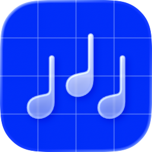

<picture>
  <source
    media="(prefers-color-scheme: dark)"
    srcset="assets/icon-dark@1x.png 1x, assets/icon-dark@2x.png 2x">
  
</picture>

# Mezzo

Mezzo is a music player for self-hosted music servers, currently available on iPhone.

> [!TIP]
> The app is in active development, and is currently available to test through TestFlight.
>
> 🔷 [**Join TestFlight to test Mezzo!**](https://testflight.apple.com/join/Ub8M3z6A)

### Issues & feedback

Found a bug, or have feedback or a feature request? Please [open an issue](https://github.com/HazemAM/mezzo-tracker/issues/new/choose)!
