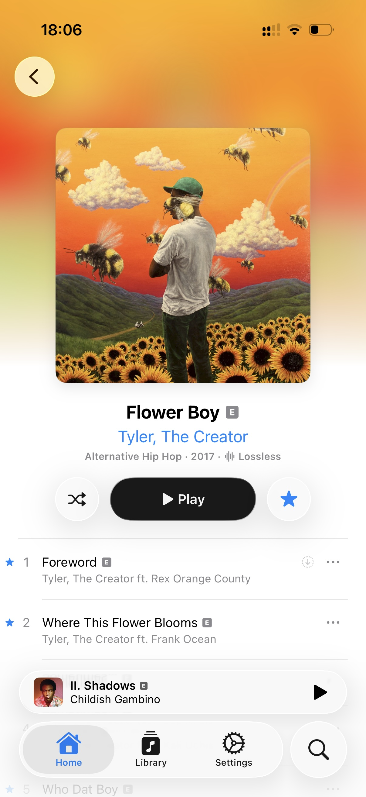
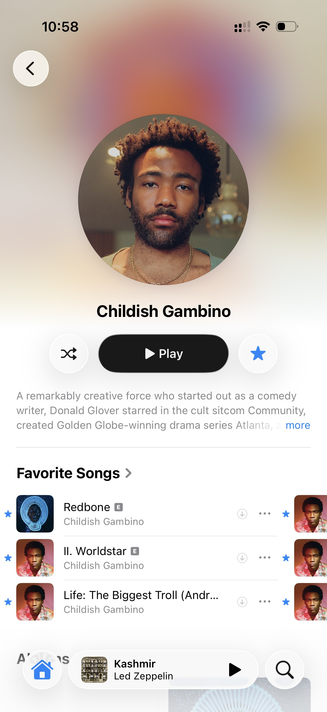

<picture>
  <source
    media="(prefers-color-scheme: dark)"
    srcset="assets/icons/dark@1x.png 1x, assets/icons/dark@2x.png 2x">
  
</picture>

# Mezzo

Mezzo is a native music player app for self-hosted music servers.

Currently available for iPhone, with support for Navidrome and other Subsonic-compatible servers.

> [!TIP]
> The app is in active development, and is currently available to test through TestFlight.
>
> 🔷 [**Join TestFlight to test Mezzo!**](https://testflight.apple.com/join/Ub8M3z6A)

## Screenshots

<table>
  <tr>
    <td align="center">
      
    </td>
    <td align="center">
      
    </td>
    <td align="center">
      
    </td>
    <td align="center">
      
    </td>
    <td align="center">
      
    </td>
  </tr>
  <tr>
    <td align="center">
      
    </td>
    <td align="center">
      
    </td>
  </tr>
</table>

## Current features

- Full synced lyrics support
  - Karaoke lyrics with word-level highlighting & visual effects
  - External sources support for songs without lyrics on your server
  - Interactive lyrics UI
  - Swipe down on the seek bar to jump between lyric lines
- Queue system
  - Swipe on a song anywhere to add it to the queue, swipe in the queue to remove it
  - Reorder songs in the queue
- Search
  - Universal search across your entire library, with a top result to jump to
  - Search only in parts of your library, or search directly in a playlist or album
- Similar music
  - Autoplay: Keep playing similar music after your queue ends
  - Song Radio: Start a radio station from any song
  - Support for sonic similarity plugins, including [AudioMuse-AI](https://github.com/NeptuneHub/AudioMuse-AI), to get better matching music similarity
- Scrobbling to server, with support for `playbackReport` extension
- Audio quality
  - Lossless and original-quality streaming
  - Separate quality and bitrate settings for Wi-Fi and mobile data
  - Smart Transcoding setting chooses the best quality based on factors like available audio cache, your network, your desired bitrate, etc.
- Album editorial notes, with text formatting support (e.g. bold, italic)
  - Available through compatible server plugins, including [Navidrome's official Apple Music plugin](https://github.com/navidrome/apple-music-plugin)
- AirPlay 2 support
- Gapless playback
- Shuffle & repeat modes
- Dark mode & light mode support

## Planned features

- Downloading for offline playback
- Playlist management
- Filtering in library
- Siri & Spotlight integration
- Recommendations
- macOS & tvOS apps
- Support for more music servers

> [!TIP]
> Want to see what’s being added in every update? Visit [Releases](https://github.com/HazemAM/mezzo-tracker/releases).

## Issues & feedback

Found a bug, or have feedback or a feature request? Please [open an issue](https://github.com/HazemAM/mezzo-tracker/issues/new/choose).
