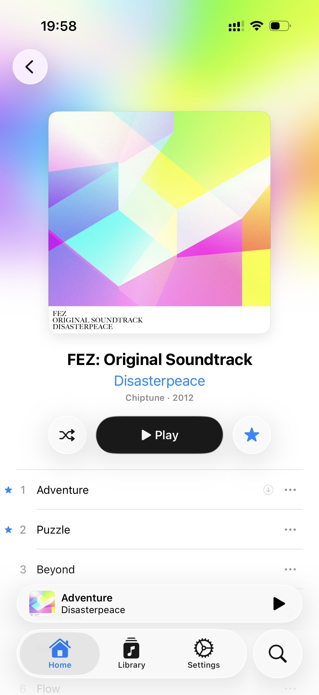
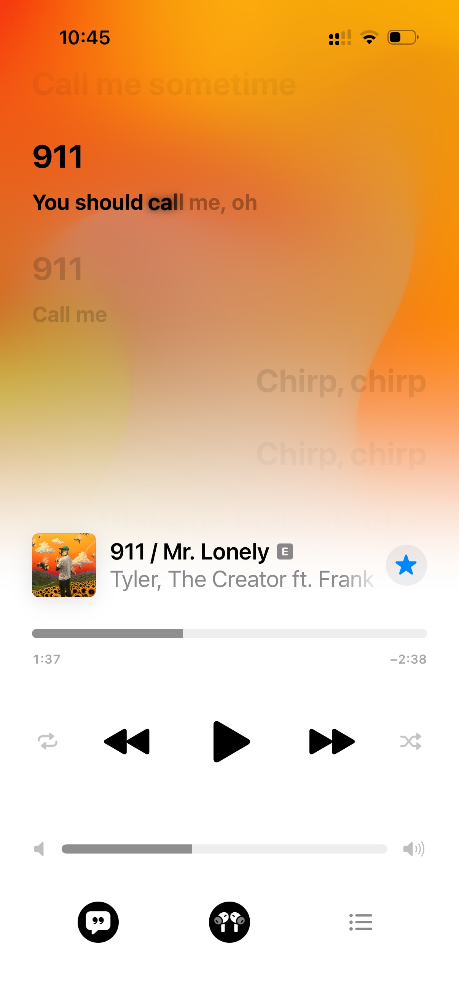

<picture>
  <source
    media="(prefers-color-scheme: dark)"
    srcset="assets/icons/dark@1x.png 1x, assets/icons/dark@2x.png 2x">
  
</picture>

# Mezzo

Mezzo is a native music player app for self-hosted music servers.

Currently available for iPhone, with support for Navidrome and other Subsonic-compatible servers.

> [!TIP]
> The app is in active development, and is currently available to test through TestFlight.
>
> 🔷 [**Join TestFlight to test Mezzo!**](https://testflight.apple.com/join/Ub8M3z6A)

## Screenshots

<table>
  <tr>
    <td align="center">
      
    </td>
    <td align="center">
      
    </td>
    <td align="center">
      
    </td>
    <td align="center">
      
    </td>
    <td align="center">
      
    </td>
  </tr>
</table>

## Current features

- Full support for synced lyrics
  - Interactive lyrics UI
  - Swipe down on the seek bar to jump between lyric lines
  - LRCLib support for songs without lyrics on your server
- Queue system
  - Swipe on a song anywhere to add it to the queue, swipe in the queue to remove it
  - Reorder songs in the queue
- Search
  - Universal search across your entire library, with a top result to jump to
  - Search only in parts of your library, or search directly in a playlist or album
- Lossless audio streaming
- Scrobbling to server
- Transcoding settings
- AirPlay 2 support
- Gapless playback
- Caching for songs
- Light & dark mode support

## Planned features

- Shuffle & repeat modes
- Downloading for offline playback
- Playlist management
- Filtering in library
- Siri & Spotlight integration
- Recommendations
- macOS & tvOS apps
- Support for more music servers

## Issues & feedback

Found a bug, or have feedback or a feature request? Please [open an issue](https://github.com/HazemAM/mezzo-tracker/issues/new/choose).
