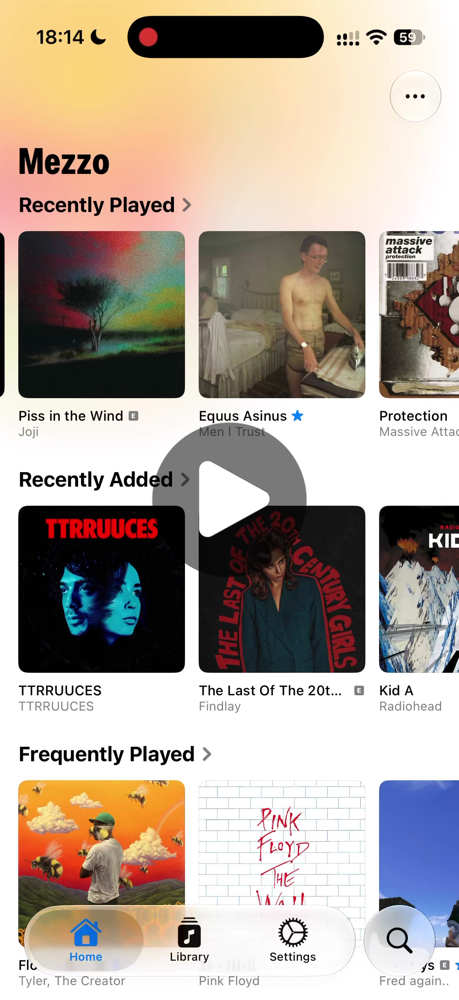

<picture>
  <source
    media="(prefers-color-scheme: dark)"
    srcset="assets/icons/dark@1x.png 1x, assets/icons/dark@2x.png 2x">
  
</picture>

# Mezzo

Mezzo is a native music player app for self-hosted music servers.

Currently available for iPhone, with support for Navidrome and other Subsonic-compatible servers.

> [!TIP]
> The app is in active development, and is currently available to test through TestFlight.
>
> 🔷 [**Join TestFlight to test Mezzo!**](https://testflight.apple.com/join/Ub8M3z6A)

## Videos

<table>
  <tr>
    <td align="center">
      
       
      Synced Lyrics
    </td>
    <td align="center">
      
       
      Offline Mode
    </td>
  </tr>
</table>

## Screenshots

<table>
  <tr>
    <td align="center">
      
    </td>
    <td align="center">
      
    </td>
    <td align="center">
      
    </td>
    <td align="center">
      
    </td>
  </tr>
  <tr>
    <td align="center">
      
    </td>
    <td align="center">
      
    </td>
  </tr>
</table>

## Current features

- Full synced lyrics support
  - Karaoke lyrics with word-level highlighting & visual effects
  - External sources support for songs without lyrics on your server
  - Interactive lyrics UI
  - Swipe down on the seek bar to jump between lyric lines
  - Lyrics are downloaded with their songs and remain available in Offline Mode, including word-level synced lyrics when available
- Audio quality
  - Lossless and original-quality streaming
  - Separate quality and bitrate settings for Wi-Fi and mobile data
  - Smart Transcoding setting chooses the best quality based on factors like available audio cache, your network, your desired bitrate, etc.
- Similar music
  - Autoplay: Keep playing similar music after your queue ends
  - Song Radio: Start a radio station from any song
  - Support for sonic similarity plugins, including [AudioMuse-AI](https://github.com/NeptuneHub/AudioMuse-AI-NV-plugin), to get better matching music similarity
- Home
  - Personalized shelves for recently played, recently added, frequently played, and random music
  - Quick access to favorite albums, songs, and artists
- Search
  - Universal search across your entire library, with a top result to jump to
  - Search only in parts of your library, or search directly in a playlist or album
  - Search is fully supported for downloaded songs, albums, artists, playlists, and genres in Offline Mode
  - Supports matching for stylized names, alternate names, and multi-language titles
- Artist pages
  - Albums organized by release type
  - Appears On section for albums where the artist is featured
  - Similar Artists section
- Queue system
  - Swipe on a song anywhere to add it to the queue, swipe in the queue to remove it
  - Reorder songs in the queue
- Playlist management
  - Add songs to one or multiple playlists, with duplicate song detection
  - Remove songs directly by swiping on them
- Scrobbling to server, with support for `playbackReport` extension for accurate scrobbling
- Album editorial notes, with text formatting support (e.g. bold, italic)
  - Available through compatible server plugins, including [Navidrome's official Apple Music plugin](https://github.com/navidrome/apple-music-plugin)
- Library browsing
  - Browse your library by albums, artists, songs, playlists, and genres, with multiple sort options
  - Filter by favorites with search and shuffle support
- Downloads
  - Download individual songs, albums, and playlists, and follow their progress in place
  - Downloads are periodically refreshed, updating automatically on Wi-Fi
  - Choose a separate download quality in Settings
- Offline Mode
  - See only your downloads, with Offline Mode activating automatically when you’re offline
  - Turn it on manually from Home, Library, or Search when you want to minimize data usage
  - Badges in Home, Library, and artist pages let you know when it’s active
  - Offline playback
    - Lyrics are downloaded with their songs and remain available in Offline Mode, including word-level synced lyrics when available
    - Albums remain fully browsable with their editorial notes and complete track lists, while unavailable songs appear dimmed
    - Every artist credited on a downloaded song or album remains browsable, including their biographies, Favorite Songs, Appears On and Similar Artists sections
  - Offline Library
    - Browse and locally search downloaded songs, albums, artists, playlists, and genres
    - Filter your downloads by favorites, sort the results, and shuffle across your full downloaded collection
- AirPlay 2 support
- Gapless playback
- Shuffle & repeat modes
- Dark mode & light mode support

## Planned features

- [ ] Creating new playlists
- [ ] Animated album artworks
- [ ] CarPlay support
- [ ] ReplayGain support
- [ ] Storage management
- [ ] Siri integration
- [ ] Spotlight integration
- [ ] Recommendations

- [x] Downloading & Offline Mode
- [x] Filtering & sorting in library
- [x] Playlist management
- [x] Shuffle & repeat modes
- [x] Search

> [!TIP]
> Want to see what’s being added in every update? Visit [**Releases**](https://github.com/HazemAM/mezzo-tracker/releases).

## Long-term roadmap

- macOS app
- tvOS app
- Support for more music servers

## Issues & feedback

Found a bug, or have feedback or a feature request? Please [open an issue](https://github.com/HazemAM/mezzo-tracker/issues/new/choose).
